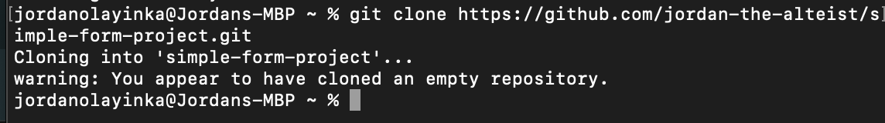
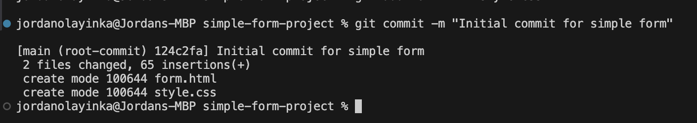
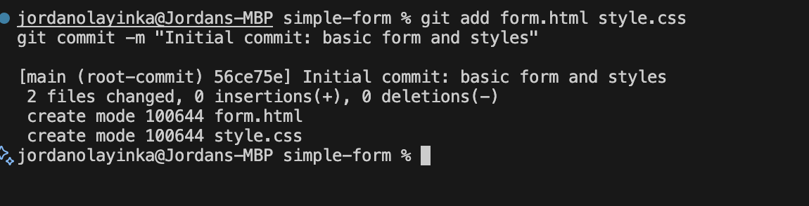
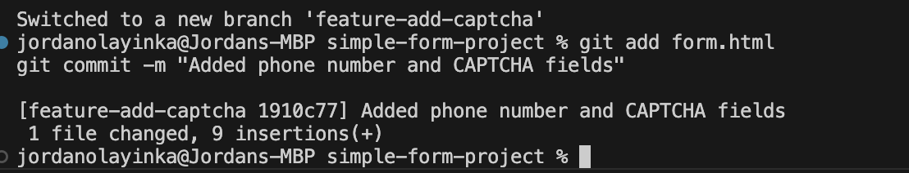
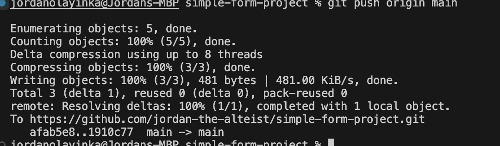
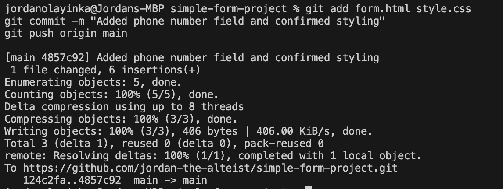
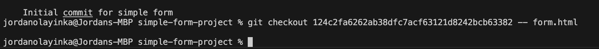
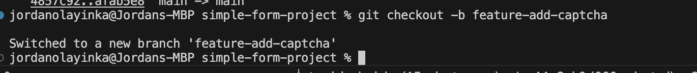
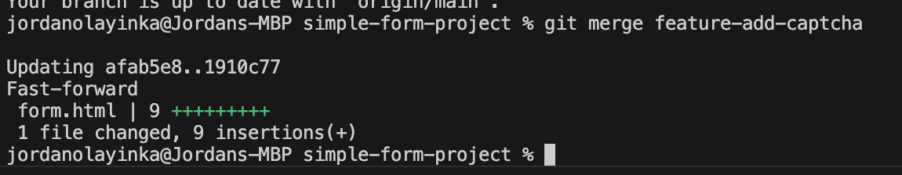
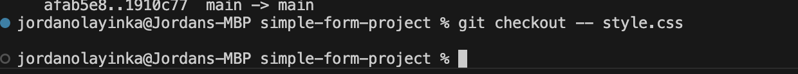

## Step 1: Clone GitHub Repository
I started by cloning the repository from GitHub to my local machine.  

## Step 2: Add and Commit Initial Files
I added the form and style files, then committed them to the local repo.  

## Step 3: Stage All Files
I staged the HTML and CSS files using `git add`.  

## Step 4: Stage Updated Form File Only

I made some edits and added only the form file before committing.  

## Step 5: Push Initial Commit to GitHub

I pushed my commits to the remote GitHub repository.  

## Step 6:Add Phone Number Field
I added a phone number field and committed the changes.  

## Step 7: Revert Form File to Previous Version

I checked out the previous commit to revert the form file.  

## Step 8: Create Feature Branch for CAPTCHA
I created a new feature branch to add a CAPTCHA field.  

## Step 9: Merge CAPTCHA Feature into Main
I merged the feature branch back into the main branch.  

## Step 10: Discard Unwanted CSS Changes
I reverted the CSS file to the last committed version.  

